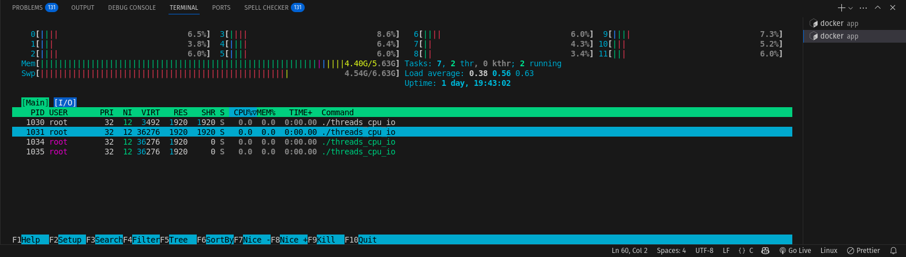
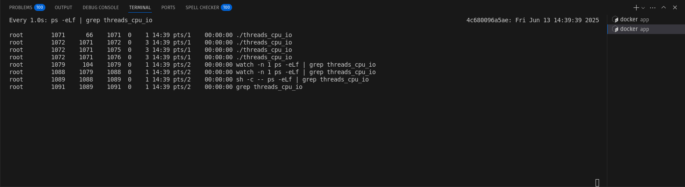
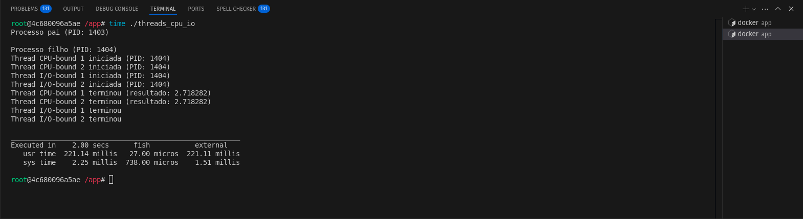
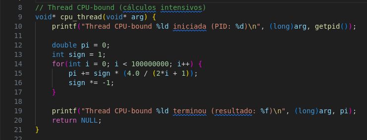

# Atividade 04 - Prática de escalonamento de tarefas

#### Aluno: Pedro Lucas Xavier da Fonseca

#### Data 13/06/2025

## Objetivo

Verificar como funciona o escalonamento de tarefas em um sistema operacional Linux por meio da execução de threads CPU-bound e I/O-bound em um ambiente isolado (container Docker).

## 1. Código inicial e execução do container

Primeiramente fiz um fork do reposótório e o clonei para minha máquina. Criei um diretório chamado `atividade-04`. Nele criei o arquivo `threads_cpu_io.c` e colei o código do exercício para realizar os testes dentro do container. Também criei um arquivo `.gitignore` para evitar o versionamento de arquivos executáveis.

Aproveitei a imagem Fedora que criei para a prática anterior e executei um novo container utilizando essa imagem como base. Mapeei o volume que contém o código C necessário para a realização dos exercícios.

## 2. Compilando e executando código C

Código C compilado e executado dentro do container

## 3. Análise de desempenho

Em um segundo terminal executei o comando `docker exec -it escalonamento fish` para executar o mesmo container e instalei os pacotes necessários a execução dos comandos `htop`, `watch` e `time`. Alterei o tempo de espera das threads i/o-bound para 10 segundos (`sleep(10)`) para conseguir realizar a análise do desempenho enquanto o código ainda estava em execução.

- Saída do comando `htop`

- Saída do comando `watch`

- Saída do comando `time`

## 4. Uso do comando `perf`

Instalei os pacotes necessários a execução do comando `perf`. Ao tentar executar o comando `perf stat ./threads_cpu_io` obtive a seguinte mensagem de erro: 

Esse erro ocorreu devido o meu container não possuir as permissões necessárias para acessar eventos de hardware. Sendo assim retornei para o host e executei um novo container com as seguintes configurações:

Tentei novamente o comando `perf stat ./threads_cpu_io` usando `sudo` e dessa vez obtive sucesso.

- desempenho do código C inicial

## 5. Modificando o código inicial

Conforme proposto no exercício, alterei o cálculo a ser realizado pelas threads CPU-bound para o cálculo do valor de Pi usando a fórmula de Leibniz.

Também adicionei duas novas threads, sendo uma i/o-bound e a outra cpu-bound.

Após as alterações compilei e executei novamente o comando `perf stat ./threads_cpu_io`, obtendo a seguinte saída:

## Conclusões

- As threads CPU-bound consumiram significativamente mais CPU.
- As threads I/O-bound ficaram grande parte do tempo dormindo (sleep), quase sem uso de CPU.
- O escalonador do sistema permitiu que threads CPU competissem mais ativamente entre si.
- Com o comando perf stat, foi possível ver o número de ciclos e o tempo real/gasto no programa.